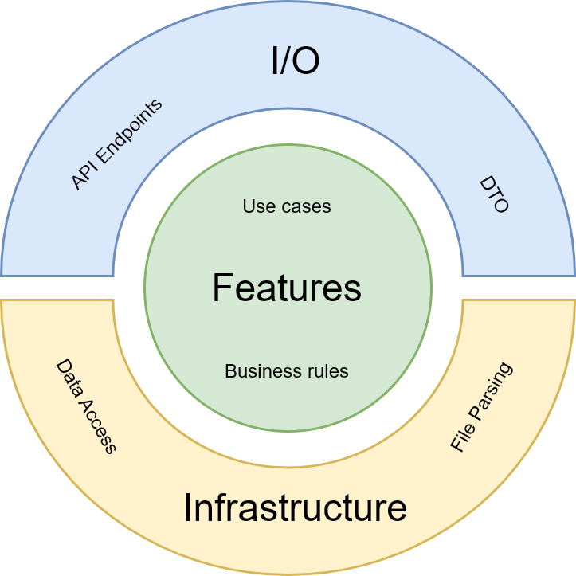

# Employees Import
A practice task to implement employees import from CSV using Golang and applying Clean Architecture

## Requirements
Create API that will have endpoints for:
 - Import records from `dataset.csv` file and save them to the database
 - CRUD for the records

## Architecture

A simplified version of the Clean Architecture where Features is the core of the application



 - Features
    - Use cases
    - Business rules
    - Validation
    - Data Access contract (repositories and unit of work interfaces)
 - I/O (Input / Output)
    - API Endpoints
    - DTO
 - Infrastructure
    - Data Access implementation (repositories and unit of work)
    - File Parsing

## Stack

 - Fiber - web framework for API endpoints
 - PGX - PostreSQL driver used for Data Access
 - PostgreSQL - Database engine

## Solution Files Structure

    .
    ├── deploy                   # deployment scripts
    ├── docker                   # docker files for project components
    └── src                      # source code for application
        ├── configuration        # abstraction to get env configuration
        ├── customTypes          # custom data types needed for the application
        ├── endpoints            # endpoints definition and DTO
        ├── features             # use cases, business rules, data access contract
        ├── parsers              # file parsing methods
        ├── persistence          # data access implementation - repositories, database objects, unit of work, migration scripts
        └── tests                # unit and integration tests  

## Notes on selected architecture

With this approach, the core application components can be rewritten or swapped without introducing breaking changes to other components:

 - Fiber can be switched to Gin. This would require rewriting of endpoints. No changes required to features, persistence and file parsing
 - PGX can be switched to Gorm. This would require rewriting of persistence. No changes required to features, file parsing or endpoints
 - PostgreSQL can be switched to MySQL. This would require changes only to persistence. No changes required to features, file parsing or endpoints

New features can be introduced without breaking exisiting features (or other layers) as each feature is independant unit.

## Launch instructions

### Docker Compose

Execute the following command to run the project to play around with it:

```
docker compose -f deploy/EmployeesImport.DockerCompose.yaml -p employees_import up -d --build
```

After that you will be able to test the API using the attached postman collection with base URL http://localhost:9898

Execute the following command to shut down the project:

```
docker compose -f deploy/EmployeesImport.DockerCompose.yaml -p employees_import down
```

### Local

Create .env file in src folder from the example below

```
DATABASE_CONNECTION_STRING=postgres://DB_USERNAME:DB_PASSWORD@DB_HOST:DB_PORT/DB_NAME
PORT=3000
```

In terminal navigate to sc folder and run

```
go run main.go
```

Given that you indicate same port as in example .env file, the API will be available at base URL http://127.0.0.1:3000. You will be able to test the API using the attached postman collection by adjusting baseUrl accordingly.

## Testing notes

Use `dataset.csv` file for testing importing employees via file upload - in postman collection navigate to `Import Employees from CSV` and selected the file

If you want to run the tests, make sure that Docker is running - repositories tests are using Test Containers that will spin up empty database for persistence testing